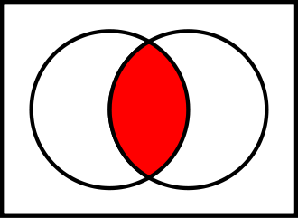
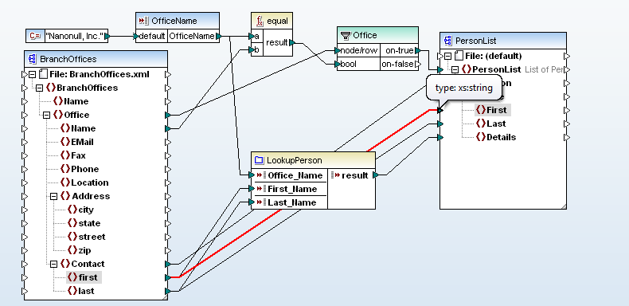

# Kurzvorstellung

## Gemeinsamer Bibliotheksverbund (GBV)

* Größter Bibliotheksverbund in Deutschland
* Zentrale Katalogisierung (ab 2018 zusammen mit dem BSZ)

## VZG

* Verbundzentrale des GBV mit Sitz in Göttingen
* Etwa 80 MitarbeiterInnen
* CBS & LBS-Hosting und -Betreuung
* Repositories, Portale, Discovery-Interfaces etc.

*Wir haben Praktika & Themen für Bachelorarbeiten!*

## Jakob Voß

* Studium der Informatik & Bibliothekswissenschaft am IBI
* Stabstelle Forschung & Entwicklung an der VZG
* <http://jakobvoss.de>

# Interoperabilität

## Interoperabilität

"Fähigkeit unterschiedlicher Systeme, möglichst nahtlos zusammenzuarbeiten" (Duden)

\vfill

*Beispiele?*

Unterschiedliche politische Systeme können miteinander arbeiten dort wo sie sich auf gemeinsame Regeln einigen.

---

](fffff-kit.jpg){width=100%}

## Interoperabilität

{width=95%}

## Beispiele

\small

* Sozialgesetzbuch Gesetzliche Krankenversicherung\
  **SGBV V § 291e Interoperabilitätsverzeichnis**

    "Die Gesellschaft für Telematik hat bis zum 30. Juni 2017 ein elektronisches Interoperabilitätsverzeichnis für technische und semantische Standards, Profile und Leitfäden für informationstechnische Systeme im Gesundheitswesen aufzubauen und dieses Interoperabilitätsverzeichnis zu pflegen und zu betreiben. Das Interoperabilitätsverzeichnis dient der Förderung der Interoperabilität zwischen informationstechnischen Systemen."

    <http://www.vesta-gematik.de/>

* Deutsche Initiative für Netzwerkinformation (DINI),\
  Kompetenzzentrum Interoperable Metadaten (KIM)\

    **DINI AG KIM**

    <https://dini.de/ag/standards/>

Es geht also um Standards und um informationstechnische Systeme.

## Interoperabilität von IT-Systemen

{width=80%}

=> Gemeinsame Standards/Schnittstellen unterschiedlicher Systeme

## Beispiele gemeinsamer Standards & Schnittstellen

* TCP/IP
* HTTP
* WWW
* ...

*Interoperabilität auf verschiedenene Ebenen!*

## Zusammenfassung

Interoperabilität basiert auf

* gemeinsamen Standards & Schnittstellen

## Beispiel aus der Praxis

Document Availability Information API (DAIA)

*Aktuelle Verfügbarkeit von Dokumenten in Bibliotheken*\
*Interoperabilität von Lokalsystemen und User Interfaces*

* Schnittstelle (HTTP-Anfrage mit Parametern)
* Datenmodell (Documents, Items, Services...)
* Datenformat (XML/JSON/RDF, inzwischen primär JSON)

\vfill

<https://gbv.github.io/daia/>

# _Metadaten_ interoperabilität

## Metadaten

* Daten die andere Daten oder Objekte strukturiert beschreiben
* Alle [...] als Daten vorliegenden Formen der Erschließung
* Wesentlich [...] das Vorhandensein einer einheitlichen Struktur

\small
Aus meinem Eintrag "Metadaten" im Lexikon der Bibliotheks- und Informationswissenschaft (LBI) von 2011

## Metadateninteroperabilität

* ein System hat (hoffentlich) eine einheitliche Struktur
* verschiedene Systeme haben verschiedene Strukturen

{width=50%}

# Beispiele

---

](reisestecker.jpg){width=60%}

## Beispiel: Adapter

* Einheitliche Struktur: Stecker, Spannung & Frequenz
* Gemeinsame Struktur: Netzspannung und -Frequenz

\vfill

=> Grundlage: gemeinsame Schnittmenge auf einer Ebene

## Allgemeines Vorgehen

* Gemeinsame Schnittmengen von Metadaten-Strukturen finden
* Adapter/Mappings auf der passenden Ebene entwickeln

*Oder auf bereits vorhandene Standards zurückgreifen!*

## Beispiel: MARC

* Entwickelt 1966 auf Basis von Karteikarten
* MARC must die! (Tennant 2002)
* Noch immer üblichster Standard (=> BIBFRAME?)

\vfill

*Wo liegt das Problem?*

## Beispiel: 900er-Felder in MARC

* Grundsätzlich Teil des MARC-Standard
* Inhaltlich nicht Teil des MARC-Standard

*eigene Erweiterungen $\neq$ gemeinsame Struktur*

## Beispiel: unAPI & SRU

* Verschiedene Schnittstellen an der VZG
* Viele, meist einheitliche Formate
* Konvertierung on-the-fly

\vfill

PICA --> MARC21 --> MARCXML --> MODS ...

\vfill

<http://unapi.gbv.de/>

## Beispiel: JSON und XML

\columstart

~~~.json
{
  "author": "Emma Goldman",
  "year": "2014",
  "isbn": "978-3-89401-810-8"
}
~~~

\columnext
\small

~~~.xml
<record>
  <author>Goldman, Emma</author>
  <year>2014</year>
  <isbn>978-3-89401-810-9</isbn>
</record>
~~~

\columend

## Beispiel: JSON & JSON

\columstart
\small

~~~.json
{
  "author": "Emma Goldman",
  "year": "2014",
  "isbn": "978-3-89401-810-8"
}
~~~

\columnext
\small

~~~.json
{
  "author": [ "Goldman, Emma" ],
  "date": "2014",
  "isbn": "9783894018108"
}
~~~

\columend

## Beispiel: Creator-Feld in Dublin Core

* Nachname, Vorname
* Vorname Nachname
* Vorname Nachname (Sprache: Original)
* ...

\vfill

*Metadaten-Strukturen wachsen wie Unkraut*

# Metadaten-Strukturen

## Metadaten-Strukturen?

* Wesentlich füt Metadaten ist das Vorhandensein einer einheitlichen Struktur.
  Diese kann u.A. als Schema (Kategorienkatalog, Datendefinitionssprache),
  Profil, Regelwerk, Datenformat oder Modell (Ontologiesprache) vorliegen.

\small
Aus meinem Eintrag "Metadaten" im Lexikon der Bibliotheks- und Informationswissenschaft (LBI) von 2011

## Wie enstehen Daten(-Strukturen)?

{width=100%}

## Schnittmengen zwischen Metadaten-Strukturen

{width=100%}

{width=100%}

# Metadateninteroperabilität durch Mappings

## Was kann gemappt werden?

{width=100%}

Ebene            Form des Mappings
---------------- ---------------------------------
Mind             Begriffsklärung       
Model            Ontology oder Terminology Mapping
Schema           Ontology oder Schema Mapping
Implementation   Schema Mapping oder Konvertierung         
---------------- ---------------------------------

## Beispiele

* Model Mapping
    * _Wir müssen reden..._

* Terminology Mapping
    * RVK [AN 65800](http://rvk.uni-regensburg.de/regensburger-verbundklassifikation-online#notation/AN%2065800) $\approx$ MeSH [D007998](https://meshb.nlm.nih.gov/#/record/ui?ui=D007998)

* Schema/Ontology Mapping
    * Datenfelder (=> JSON/XML-Beispiel)

* Konvertierung
    * Zeichenkodierungen

## Sprachgebrauch uneinheitlich!

\columstart

**Strukturen**

* Model
* Schema
* Format
* Ontologie
* Terminologie
* ...

\columnext

**aufeinander abbilden**

* Mapping
* Matching
* Konkordanz
* Crosswalk
* Konvertierung
* ... 

\columend

# Mapping-Praxis

## Wie kommen wir zu Mappings?

* Intellektuelle Vergleiche
    * Konkordanztabellen erstellen
    * Konvertierung programmieren
* Automatische Verfahren und Heuristiken
    * Label-basiert ("author"="authors")
    * Strukturbasiert (z.B. Datentypen)
    * Instanzbasiert

## Mapping-Verfahren und -Tools

* Viele Forschunsgssysteme
    * <http://oaei.ontologymatching.org/> (OAEI)
    * <http://ontologymatching.org/>
* Bestandteil einiger ETL- und BD-Tools
* Einige erfolgreiche kommerzielle Systeme
    * Eher spezialisiert
    * Mehr Konvertierung statt Mapping statt Matching

## Beispiel: Altanova MapForce

{width=100%}

## Beispiel: Projekt coli-conc

<http://coli-conc.gbv.de/>

* Sammlung von Terminologien und Konkordanzen\
  => zusammen mit [BARTOC.org](http://bartoc.org)
* Bereitstellung von Konkordanzen
* Tool zur Erstellung und Bewertung von Konkordanzen

*DDC, RVK, GND, BK...*

## Heuristik: Instanz-basiertes Matching

* Idee
    * Gleiche oder ähnliche Werte(verteilungen)

* Annahmen
    * Beide Schemas müssen mit Werten gefüllt sein
    * Beide Datenbasen müssen Duplikate enthalten
    * Duplikate müssen gleiche Attribute enthalten

* Beispiel: coli-conc Mapping-Algorithmus
    * Titeldaten im GBV-Katalog hat Notationen mehrerer KOS
    * Kookkurenz => Semantische Ähnlichkeit

# Zusammenfassung

## Metadaten

* Beschreibende Daten mit einheitlicher Struktur
* auf verschiedenene Ebenen (Modell, Schema, Format...)
* mal explizit (Standard, Regeln...) mal implizit

## Interoperabilität

* Unterschiedliche Systeme\
  => Unterschiedliche (Metadaten)strukturen
* Schnittmenge von Gemeinsamkeiten
* Mapping auf einer passenden Ebene
* Heuristiken zum Finden von Mappings

## Weitere Quellen

* Quellen dieses Vortrags (CC BY-SA)
  <https://github.com/jakobib/metadatainteroperability2017>

* Vorlesungsfolien zur semantischen Datenintegration\
  <https://github.com/hshdb/MWM-317-02>

* Jakob Voss: Describing Data Patterns (2013)
  <http://aboutdata.org>

