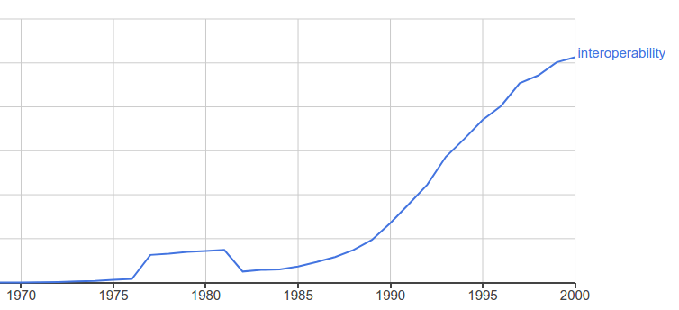
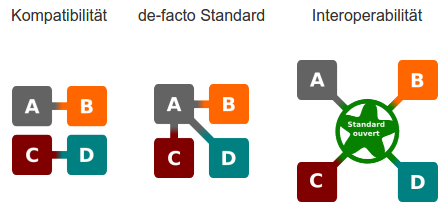

## Kurzvorstellung

\small

* GBV
    * Größter Bibliotheksverbund in Deutschland
    * Zentrale Katalogisierung (ab 2018 zusammen mit dem BSZ)
    * LBS-Hosting und Betreuung
    * Repositories, Portale & Discovery-Interfaces etc.

* VZG
    * Verbundzentrale in Göttingen
    * Etwa 80 MitarbeiterInnen

* Jakob Voß
    * Studium der Bibliothekswissenschaft & Informatik am IBI
    * Stabstelle Forschung & Entwicklung an der VZG
    * <http://jakobvoss.de>

*Wir haben Praktika & Themen für Bachelorarbeiten!*

# Interoperabilität

## Interoperabilität

"Fähigkeit unterschiedlicher Systeme, möglichst nahtlos zusammenzuarbeiten" (Duden)

\vfill

*Beispiele?*

Unterschiedliche politische Systeme können miteinander arbeiten dort wo sie sich auf gemeinsame Regeln einigen.

## Interoperabilität

{width=95%}

## Beispiele

\small

* Sozialgesetzbuch Gesetzliche Krankenversicherung\
  **SGBV V § 291e Interoperabilitätsverzeichnis**

    "Die Gesellschaft für Telematik hat bis zum 30. Juni 2017 ein elektronisches Interoperabilitätsverzeichnis für technische und semantische Standards, Profile und Leitfäden für informationstechnische Systeme im Gesundheitswesen aufzubauen und dieses Interoperabilitätsverzeichnis zu pflegen und zu betreiben. Das Interoperabilitätsverzeichnis dient der Förderung der Interoperabilität zwischen informationstechnischen Systemen."

    <http://www.vesta-gematik.de/>

* Deutsche Initiative für Netzwerkinformation (DINI),\
  Kompetenzzentrum Interoperable Metadaten (KIM)\

    **DINI AG KIM**

    <https://dini.de/ag/standards/>

Es geht also um Standards und um informationstechnische Systeme.

## Interoperabilität von IT-Systemen

{width=80%}

=> Gemeinsame Standards/Schnittstellen unterschiedlicher Systeme

## Beispiele gemeinsamer Standards & Schnittstellen

* TCP/IP
* HTTP
* WWW
* Unicode
* RDFa
* RDF
* ...

*Interoperabilität auf verschiedenene Ebenen!*

# Metadaten

## Was sind eigentlich Daten?

Implizite Auffassungen von Daten

1) Daten als Fakten

    Semantic Web, Metadaten...

2) Daten als Beobachtungen

    Messwerte, Content, Big Data...

3) Daten als binäre Nachrichten

    Dokumente, Forschungsdaten...

\vfill

\small Hintergrund siehe <http://libreas.eu/ausgabe23/02voss/>

## Metadaten

* Aussagen über etwas
* Vorhandensein einer einheitlichen Struktur

\small ~siehe Lexikon des Bibliotheks und Informationswesens~

## Daten auf verschiedenen Ebenen

{width=100%}

## Metadateninteroperabilität

Interoperabilität
  : gemeinsame Standards/Schnittstellen unterschiedlicher Systeme

Metadateninteroperabilität
  : gemeinsame Metadaten-Standards unterschiedlicher Systeme

\vfill

*Was sind Metadaten-Standards?*

# Zwischenfazit

...

## Anwendung: Informationsintegration

* Konvertierung von Daten

